## dp-service patterns and frameworks

Some common frameworks and patterns are used in the service implementations, including gRPC server, service request handling, MongoDB interface, configuration, performance benchmarking, regression testing, and integration testing.

The diagram below gives an overview of the key classes used to build a service, using the concrete Annotation Service classes.  The same pattern is used in all Data Platform service implementations, with analogous concrete classes for each.


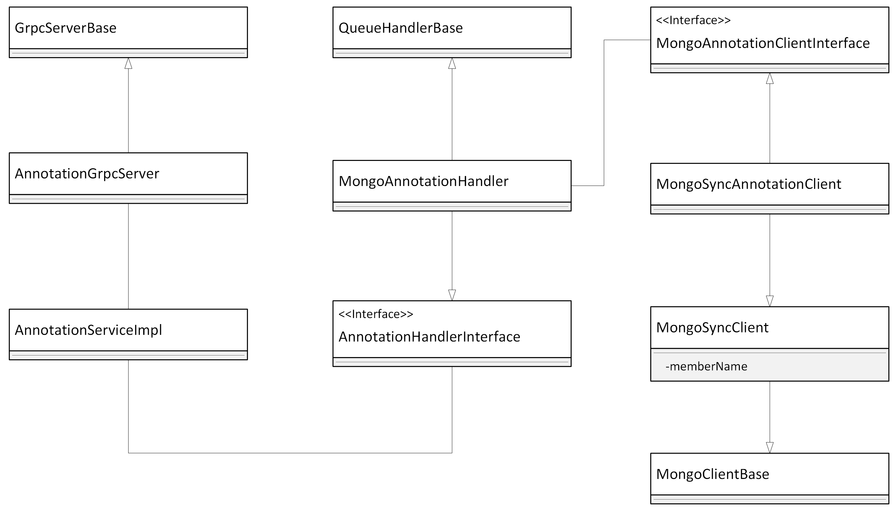


The remainder of this section drills into each of the frameworks and patterns mentioned above, using the overview class diagram as a road map and exposing additional detail where appropriate.


### gRPC server

Each service implementation includes an extension of the framework class "GrpcServerBase" that is the entry point for running the service.  The diagram below shows the Annotation Service extension of that base class, "AnnotationGrpcServer".  The extension implements the "main()" method to run the application.


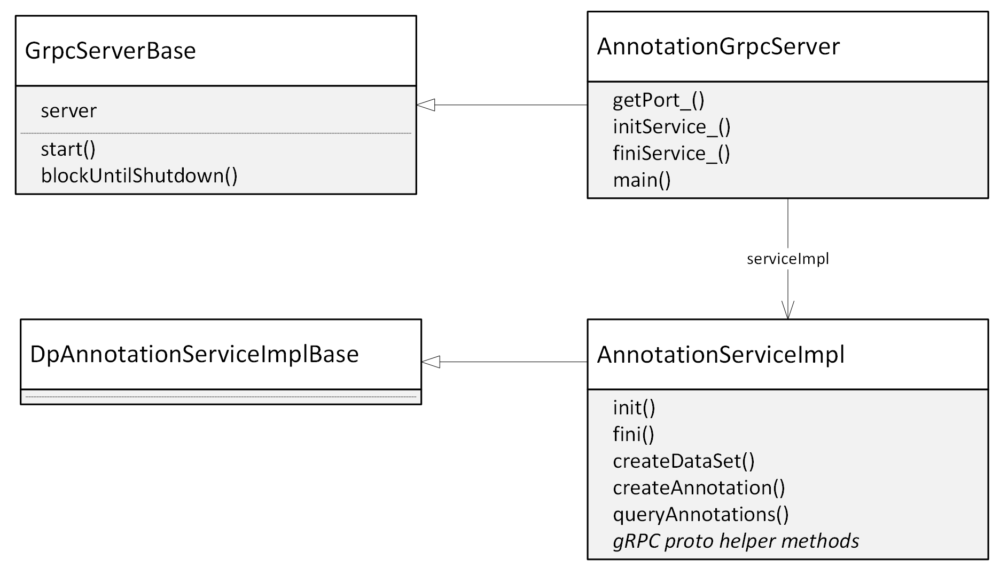


"GrpcServerBase" implements the method "start()" to initialize the gRPC communication framework, instantiate the class implementing the service implementation, and add a shutdown hook to handle VM shut down.  It also implements "blockUntilShutdown()" to allow "main()" to wait for the application to complete and clean up the service.

The base class defines an abstract method interface to support the framework method implementations.  "getPort_()" returns the port number for the service's gRPC server.  initService_() and finiService_() are used to initialize and finalize the underlying service implementation.

For each service, the gRPC "protoc" compiler generates a service implementation stub class that defines the methods implemented by that service.  The service extends that stub class to provide a useful implementation of the service API methods.  In the case of the AnnotationService, this class is "AnnotationServiceImpl".

"AnnotationServiceImpl" provides methods "init()" and "fini()", for use by "initService_()" and "finiService_()", respectively, in "AnnotationGrpcServer" to initialize and finalize the service.  It overrides methods that implement the gRPC service API, in this case "createDataSet()", "createAnnotation()", and "queryAnnotations()".

The handling for incoming requests by those methods is described in the next section.


### service request handling framework

The diagram below shows the framework for handling incoming requests.


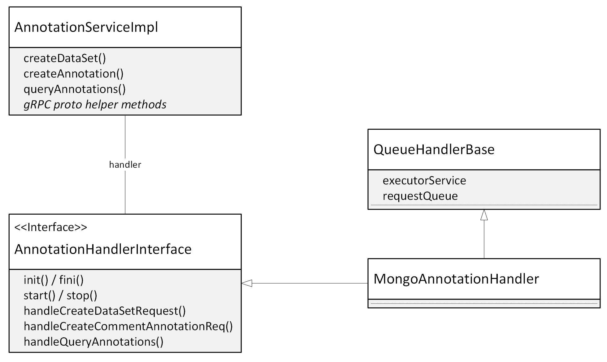


Requests coming in via the gRPC communication framework are delivered to the "AnnotationServiceImpl" for processing.  Its main purpose is to provide useful implementations of the Annotation Service API methods.  It also provides helper methods for the gRPC protocol related to the service, like creating response objects and sending them in the response stream.

Each service implementation defines a handler interface that defines the methods needed for handling requests.  In the case of the AnnotationService, the interface is AnnotationHandlerInterface.  It defines control methods for use by the "AnnotationServiceImpl" in managing the handler including "init()", "fini()", "start()", and "stop()".  It defines methods for handling requests, including handleCreateDataSetRequest(), handleCreateCommentAnnotationReq(), and handleQueryAnnotations().

We use an interface to define the handler methods so that we don't prescribe a particular implementation.  That said, our initial implementation uses MongoDB for persistence and the class "MongoAnnotationHandler" implements the "AnnotationHandlerInterface" by using MongoDB to store and retrieve annotations.

The framework provides the class "QueueHandlerBase" that provides a simple framework implementing the producer-consumer pattern that is extended in the concrete service handler implementation.  It includes a queue for incoming tasks, and a pool of worker threads for processing them.

In addition to implementing the "AnnotationHandlerInterface" defining the service API methods, "MongoAnnotationHandler" also extends "QueueHandlerBase" to utilize the task queue and worker thread pool.

The next diagram provides additional detail for the "QueueHandlerBase" framework.


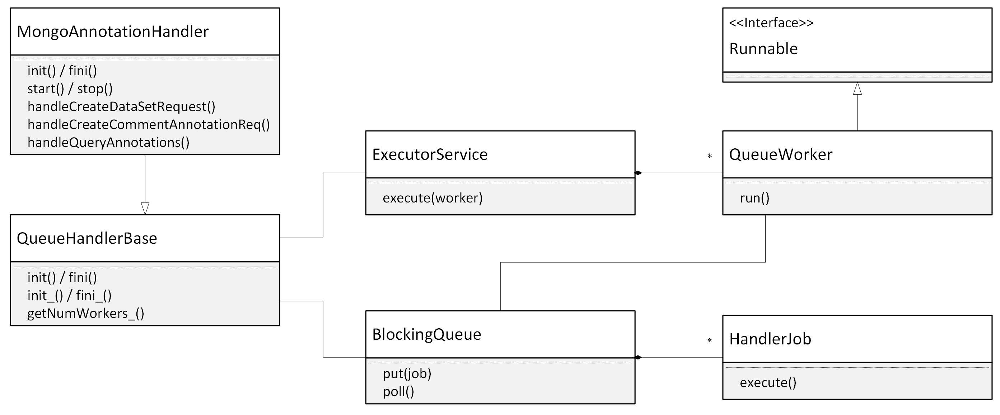


In "QueueHandlerBase" initialization, the concrete "MongoAnnotationHandler" implementation of abstract method "getNumWorkers_()" is used to create a Java "ExecutorService" containing the specified number of "QueueWorker" instances, starting each of them via "execute()".  This invokes the workers' "run()" method, which monitors the handler's "BlockingQueue" for new tasks using poll().

The "MongoAnnotationHandler" methods for handling incoming requests, such as "handleQueryAnnotations()" create an instance of a service-specific subclass derived from HandlerJob, and add it to the queue using "put(job)".  The next available "QueueWorker" removes the job from the queue, and processes it by calling the job's "execute()" method.

"HandlerJob" doesn't prescribe any particular implementation or relationship for derived concrete classes, and could probably be an interface instead of a class.  Regardless, the intention is to support a variety of diffent types of jobs.  The primary use case for a job is to 1) perform some database operation like creating an item or executing a query and 2) dispatch the results of that operation in the response stream for the API request.

The diagram below shows the static relationships for a "QueryAnnotationsJob", responsible for executing a "queryAnnotations()" API request and dispatching the results in the response stream.


The "QueryAnnotationsJob" is removed from the handler's task queue by a worker, who invokes the job's "execute()" method.  The job uses the handler's "MongoAnnotationClientInterface" to invoke "executeQueryAnnotations()" with the "QueryAnnotationsRequest", and passes the resulting database Cursor object to the "AnnotationsResponseDispatcher" method "handleResult()" for dispatching the query result.

The dispatcher uses a convenience method "sendQueryAnnotationsResponse()" on "AnnotationServiceImpl" to send the "QueryAnnotationsResponse" created by the dispatcher and containing the query results in the API response stream via the "StreamObserver" object's onNext() method.

This pattern for executing an API request and dispatching the response is used in all the service implementations for handling all requests.  Instead of repeating diagrams like above for each case, they are summarized in the following tables listing service rpc method, handler method, job subclass, and dispatcher subclass, with a table for each service.


#### annotation service request handling


<table>
  <tr>
   <td><strong>rpc method</strong>
   </td>
   <td><strong>handler method</strong>
   </td>
   <td><strong>job class</strong>
   </td>
   <td><strong>dispatcher class</strong>
   </td>
  </tr>
  <tr>
   <td>createDataSet
   </td>
   <td>handleCreateDataSetRequest
   </td>
   <td>CreateDataSetJob
   </td>
   <td>CreateDataSetDispatcher
   </td>
  </tr>
  <tr>
   <td>createAnnotation
   </td>
   <td>handleCreateCommentAnnotationRequest
   </td>
   <td>CreateCommentAnnotationJob
   </td>
   <td>CreateAnnotationDispatcher
   </td>
  </tr>
  <tr>
   <td>queryAnnotations
   </td>
   <td>handleQueryAnnotations
   </td>
   <td>QueryAnnotationsJob
   </td>
   <td>AnnotationsResponseDispatcher
   </td>
  </tr>
</table>


#### ingestion service request handling


<table>
  <tr>
   <td><strong>rpc method</strong>
   </td>
   <td><strong>handler method</strong>
   </td>
   <td><strong>job class</strong>
   </td>
   <td><strong>dispatcher class</strong>
   </td>
  </tr>
  <tr>
   <td>ingestDataStream
   </td>
   <td>onNext
   </td>
   <td>TODO
   </td>
   <td>TODO
   </td>
  </tr>
</table>


#### query service request handling


<table>
  <tr>
   <td><strong>rpc method</strong>
   </td>
   <td><strong>handler method</strong>
   </td>
   <td><strong>job class</strong>
   </td>
   <td><strong>dispatcher class</strong>
   </td>
  </tr>
  <tr>
   <td>queryData
   </td>
   <td>handleQueryData
   </td>
   <td>QueryDataJob
   </td>
   <td>DataResponseUnaryDispatcher
   </td>
  </tr>
  <tr>
   <td>queryDataStream
   </td>
   <td>handleQueryDataStream
   </td>
   <td>QueryDataJob
   </td>
   <td>DataResponseStreamDispatcher
   </td>
  </tr>
  <tr>
   <td>queryDataBidiStream
   </td>
   <td>handleQueryDataBidiStream
   </td>
   <td>QueryDataJob
   </td>
   <td>DataResponseBidiStreamDispatcher
   </td>
  </tr>
  <tr>
   <td>queryTable
   </td>
   <td>handleQueryTable
   </td>
   <td>QueryTableJob
   </td>
   <td>TableResponseDispatcher
   </td>
  </tr>
  <tr>
   <td>queryMetadata
   </td>
   <td>handleQueryMetadata
   </td>
   <td>QueryMetadataJob
   </td>
   <td>MetadataResponseDispatcher
   </td>
  </tr>
</table>


### handling for bidirectional streaming API methods

The core request handling pattern described in [section "service request handling framework"](#service-request-handling-framework) is used to handle all requests, whether 1) unary with single request / response, 2) single request with server-side streaming response, or 3) bidirectional streaming with multiple requests and responses.

The third case is a special one, because we need a mechanism for directing subsequent requests from the API RPC method's request stream to the existing handler for the initial request.  This is illustrated by the handling framework for the bidirectional time-series data query method, "queryDataBidiStream()".

That query method is a bidirectional streaming method, where the initial request specifies the time-series data query parameters, the initial response contains the first set of query results, and subsequent requests are sent to retrieve incremental results until the result set is exhausted.

Behind the scenes, a MongoDB query is executed to retrieve the relevant time-series data.  The cursor for the query results is used to generate the initial result set in the response stream, but we want to hold on to the cursor to fulfill the subsequent requests for additional query results so that the query doesn't need to be re-executed.  The diagram below illustrates the framework for handling "queryDataBidiStream()".


 handling")


When "QueryServiceImpl.queryDataBidiStream()" receives a new request, it creates a "QueryResponseBidiStreamRequestStreamObserver" to handle the request stream.  The initial request received by its "onNext()" method contains the parameters for the time-series data query and is dispatched to "QueryHandlerInterface.handleQueryBidiStream()".  This request is handled as illustrated in [section "service request handling framework"](#service-request-handling-framework).  That method also returns a "QueryResultCursor" to the request stream observer.

The initial query results are returned in the response stream by the dispatcher.  Subsequent requests arriving in the request stream observer's "onNext()" method contain a cursor operation to retrieve the next set of results and are dispatched to "QueryResultCursor.next()", which creates the next response message and sends it via the dispatcher.  This continues until the result set is exhausted and / or the API stream is closed.


### MongoDB interface

MongoDB is used at the core of all Data Platform service implementations for data persistence.  [section "service request handling framework"](#service-request-handling-framework) showed how the handler framework for the annotation service (as an illustration for all the services), including the concrete "HandlerJob" and "Dispatcher" implementations, use a concrete implementation of "MongoAnnotationClient" to provide the database operations needed by the handler framework.  This section provides further details about how that is accomplished.

The diagram below shows the framework of classes comprising the Data Platform's database interface, again using the Annotation Service implementation as an example.


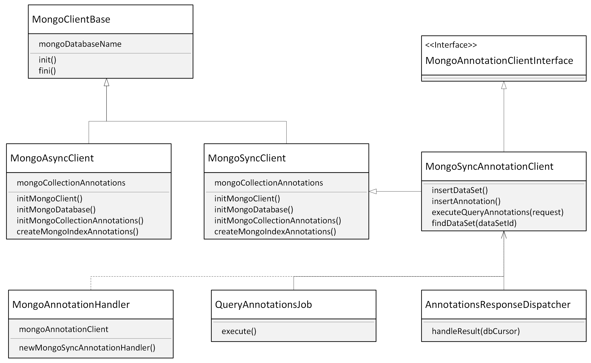


The core class in the framework is "MongoClientBase".  This abstract class is intended to be extended by intermediate abstract classes that correspond to the various MongoDB Java driver implementations that can be used to provide access to MongoDB operations by the service handler framework.  There are at least three different drivers, including "sync", "async", and a new async driver called "reactivestreams".

We wanted to compare the performance of the "sync" and "reactivestreams" drivers in the context of the Data Platform implementations (in particular for the Ingestion Service implementation), so we built the intermediate abstract classes "MongoSyncClient" using the MongoDB "sync" driver and "MongoAsyncClient" using the MongoDB "reactivestreams" driver.

We used this approach, with an abstract generic base class and two intermediate abstract classes, because the way the two MongoDB Java drivers define the same class names (like MongoClient, MongoCollection, MongoDatabase) in different packages ("com.mongodb.client" for the "sync driver and "com.mongodb.reactivestreams.client" for the "reactivestreams" driver).

The base class "MongoClientBase" primarily defines an abstract interface with methods like "initMongoClient()", "initMongoDatabase()", "initMongoCollectionAnnotaitons()", and "createMongoIndexAnnotations()".  The two intermediate classes "MongoSyncClient" and "MongoAsyncClient" implement those methods using the "sync" and "reactivestreams" drivers, respectively.

Separately, each service defines an interface whose methods define the database operations needed by the service implementation.  For the Annotation Service, the interface "MongoAnnotationClientInterface" defines methods like "insertDataSet()", "insertAnnotation()", "executeQueryAnnotations()" and "findDataSet()".  An interface is used so that a concrete interface implementation can derive from either "MongoSyncClient" or "MongoAsyncClient" since the code to insert and retrieve documents is different for the underlying "sync" and "reactivestreams" MongoDB Java drivers.

For the Ingestion Service implementation, we developed both "MongoSyncIngestionClient" and "MongoAsyncIngestionClient" so that we could compare the performance of the two Java drivers in the context of data ingestion.  The "sync" driver appears to out-perform the "reactivestreams" driver for our ingestion use case, though we have not performed exhaustive testing and will probably do so at some point.  The service implementations are asynchronous by design, so we don't need to use an asynchronous MongoDB Java driver to accomplish that objective.

For the Query and Annotation Services, where performance is important but not on the same level as the Ingestion Service, we built a single concrete database client implementation extending the intermediate class "MongoSyncClient".  This class inherits the database client connection management framework from "MongoClientBase", and provides overrides for the service-specific interface methods in "MongoAnnotationClientInterface" to provide the database operations needed by the service implementation.

The handler for each service implementation including "MongoAnnotationHandler" provides factory methods such as "newMongoSyncAnnotationHandler()" to create a handler instance initialized with the synchronous database client "MongoSyncIngestionClient".  When new jobs are added to the handler's task queue, they are provided with a reference to the database client for accessing database operations by both the job and its dispatcher, as needed.  This is illustrated in the diagram by "QueryAnnotationsJob" and the corresponding "AnnotationsResponseDispatcher" which call the database client methods "executeQueryAnnotations()" and "findDataSet()" in the execution of their methods "execute()" and "handleResult()", respectively.


### serialization of protobuf objects to MongoDB documents

The Ingestion Service adds a document to the MongoDB "buckets" collection for each "DataColumn" (vector of samples) contained in an ingestion request's data frame.  The documents contain the vector's "DataValues" and the corresponding "DataTimestamps" for those values, as well as other details such as bucket start and end time.

Originally, the Ingestion Service used a polymorphic hierarchy of parameterized classes derived from the base class, "BucketDocument" to handle the various data types supported by the API "DataValue" message.  This approach required a Java "POJO" class for each supported API "DataValue" type for mapping the API type to a Java type.  For example, the Java class "DoubleBucketDocument" extends the base "BucketDocument" class with the type parameter "Double" to handle the API DataValue value type "doubleValue", and the Java class "StringBucketDocument" with parameter type "String" handles the API DataValue value type "stringValue".

While this approach is fairly straightforward for the basic scalar data types defined by the API that map to primitive Java types, it encounters problems handling more complex API data types like "Array" and "Structure" which can contain nested references to other "DataValue" types.  It would be challenging to design Java BucketDocument subclasses to handle arbitrarily nested arrays of structures that might contain arrays of different data types, etc.

In order to support these more complex API data types, we changed approach in version 1.4 to serialize the protobuf "DataColumn" object directly to the "BucketDocument" as an opaque byte array field without otherwise unpacking the column's "DataValues".  This allows us to support all API data types (including arbitrarily nested arrays and structures) while eliminating the need for the hierarchy of classes derived from "BucketDocument" for handling each unique API data type.

In addition to simplifying the code base, this change improved ingestion performance significantly and reduced the MongoDB storage footprint (due to the compression used in protobuf serialization).

We decided to use the same approach for storing "DataTimestamps", which can contain either a "SamplingClock" (specifying the start time, number of samples, and sample period) or "TimestampsList" (with an explicit list of data timestamps), in the "BucketDocuments".  Instead of unpacking the "DataTimestamps" from the ingestion request and adding conditional fields to "BucketDocument" to store the constituent "SamplingClock" or "TimestampsList", we simply serialize the "DataTimestamps" protobuf object to the "BucketDocument" as an opaque byte array field.

The class diagram below shows part of the original polymorphic "BucketDocument" hierarchy.  The base class uses the type parameter "T" to indicate the type of data managed by the class.  It also includes the "@BsonDiscriminator" annotation to specify that MongoDB should use the value of the "dataType" field to determine which Java POJO class to use for each document.  The derived class "DoubleBucketDocument" uses the type parameter "Double" to show that the bucket contains Java Double data values.  Similarly, the "StringBucketDocument" derived class manages "String" data values.

The diagram also shows that the base class uses fields to capture the details for the bucket's "DataTimestamps", with fields for both "SamplingClock" and "TimestampsList" details.

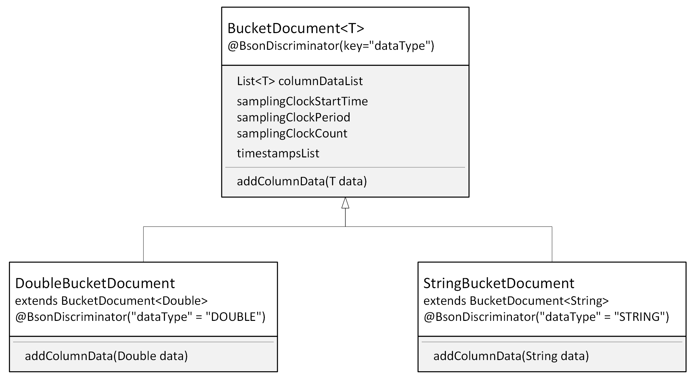

In Data Platform version 1.4, the polymorphic "BucketDocument" hierarchy shown above is replaced by the new standalone "BucketDocument" class shown in the class diagram below.  It contains byte array fields "dataColumnBytes" and "dataTimestampsBytes" to hold the serialized "DataColumn" and "DataTimestamps" for the bucket, respectively.  It provides methods for reading and writing the serialized object to the bucket, and getting the API type case and name for the serialized object.

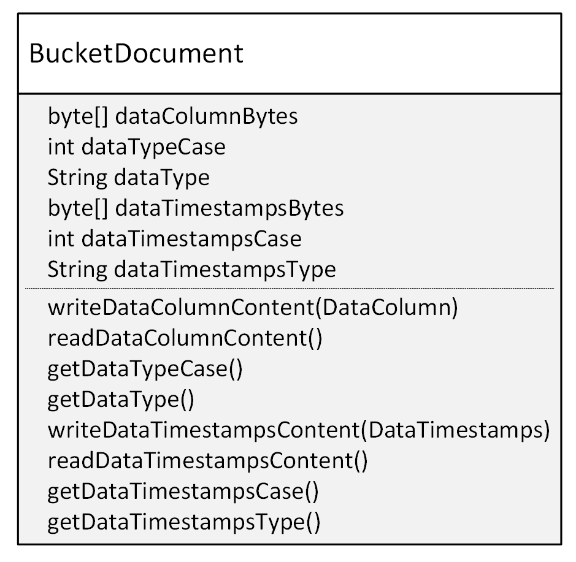

### using SerializedDataColumns for improved API performance

As of version 1.9, a mechanism is added for using "SerializedDataColumns" in the API methods for data ingestion, query, and subscription for improved performance.

This is made possible by the change to storing the byte data representation of its DataColumn in MongoDB BucketDocuments, as we no longer need access to the individual DataValues in a protobuf DataColumn during ingestion.

The APIs for data ingestion, query, and subscription now include an option for sending SerializedDataColumns instead of regular DataColumns.  Using this mechanism improves performance significantly by avoiding redundant serialization and deserialization operations performed by the gRPC communication framework.  

Sending regular DataColumns in ingestion requests requires 3 serialization operations.  The client performs serialization when sending the request; the server performs deserialization when receiving the request, and then the data are re-serialized for compact storage in MongoDB.  Sending SerializedDataColumns in ingestion requests requires a single serialization operation in the client with no deserialization or re-serialization required in the server before storage in MongoDB.  This results in ingestion performance improvements of 2-3x.  Similar improvements are made in the query and subscription APIs.

The ingestion API method variants ingestData(), ingestDataStream(), and ingestDataBidiStream() are modified to include a new optional list of SerializedDataColumns in the request's IngestionDataFrame object.  The API client can send either a list of regular DataColumns, SerializedDataColumns, or both.  Clients seeking maximum performance should send SerializedDataColumns, by manually serializing each DataColumn to its ByteString representation for use in the API request.

The query API method variants queryData(), queryDataStream(), and queryDataBidiStream() are modified in a similar fashion.  The request's QuerySpec now includes a flag "useSerializedDataColumns" that is set to indicate that the client wishes to receive SerializedDataColumns in the query result instead of regular ones.  When the flag is set, the response's DataBuckets contain a SerializedDataColumn instead of a regular one.  Clients seeking maximum performance should set the flag in the query request, and must manually deserialize each DataBucket's serializedDataColumn by parsing a DataColumn from the SerializedDataColumn's "dataColumnBytes" byte representation of the column.

When ingestion requests utilize SerializedDataColumns for improved performance, corresponding notifications sent by the subscribeData() API for subscribed PVs will automatically use SerializedDataColumns for maximum performance in subscription communication.

These changes are all made to be backward compatible, so that existing API clients continue to work without modification.

New ingestion and query performance benchmark applications are added including BenchmarkIngestDataStreamBytes and BenchmarkQueryDataStreamBytes, respectively.

Below is a Java code snippet showing how to convert a list of regular DataColumns to a list of SerializedDataColumns for use in an IngestDataRequest's IngestionDataFrame.
```
// build a list of DataColumns
final List<DataColumn> frameColumns = new ArrayList<>();

// create a DataColumn object
DataColumn.Builder dataColumnBuilder = DataColumn.newBuilder();
dataColumnBuilder.setName("S01-GCC01");

// add a DataValue to the column
DataValue.Builder dataValueBuilder = DataValue.newBuilder().setDoubleValue(12.34);
dataColumnBuilder.addDataValues(dataValueBuilder.build());

// add DataColumn to list
frameColumns.add(dataColumnBuilder.build());

// generate a list of SerializedDataColumn objects from list of DataColumn objects, and add them to IngesitonDataFrame
IngestDataRequest.IngestionDataFrame.Builder dataFrameBuilder
        = IngestDataRequest.IngestionDataFrame.newBuilder();
for (DataColumn dataColumn : frameColumns) {
    final SerializedDataColumn serializedDataColumn =
            SerializedDataColumn.newBuilder()
                    .setName(dataColumn.getName())
                    .setDataColumnBytes(dataColumn.toByteString())
                    .build();
    dataFrameBuilder.addSerializedDataColumns(serializedDataColumn);
```


Below is a Java code snippet showing how to convert a SerializedDataColumn in the query result DataBucket to a regular DataColumn for accessing its name and data values.
```
if (responseBucket.hasSerializedDataColumn()) {
    DataColumn responseDataColumn = null;
    try {
        responseDataColumn = DataColumn.parseFrom(responseBucket.getSerializedDataColumn().getDataColumnBytes());
    } catch (InvalidProtocolBufferException e) {
        fail("exception parsing DataColumn from SerializedDataColumn: " + e.getMessage());
    }
}
```


### data subscription framework

As of v1.7, the Ingestion Service provides a mechanism for subscribing to new data received in the ingestion stream, via the subscribeData() API method.  Key components involved in the data subscription handling framework are described in more detail below.

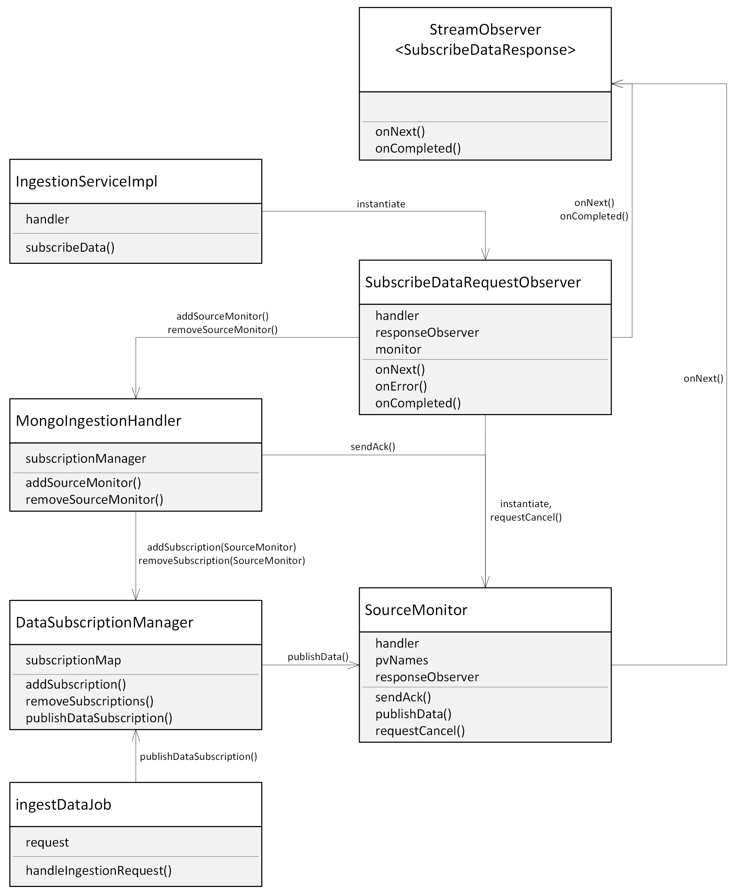

Invocations of the Ingestion Service's subscribeData() API method are dispatched to IngestionServiceImpl.subscribeData().  That method simply creates an instance of SubscribeDataRequestObserver to handle messages sent by the client in the API method's request stream.

SubscribeDataRequestObserver implements the StreamObserver<SubscribeDataRequest> interface.  Its onNext() method receives incoming request messages and performs further processing depending on the message payload.  For NewSubscription payloads, it performs validation and either sends a reject for an invalid request or creates a SourceMonitor instance encapsulating subscription details and handling.  For CancelSubscription payloads, if there is a gRPC error (onError() is invoked) or the client closes the request stream (onCompleted() is invoked), SourceMonitor.requestCancel() is called to cancel the subscription before closing the API response stream.

A new class, DataSubscriptionManager, is added to the handler framework for managing data subscription registrations and publishing data to subscribers as it is received by the Ingestion Service.  The data structures employed by DataSubscriptionManager use concurrency mechanisms for thread safety since requests might arrive on different threads.

The new SourceMonitor instance is passed by SubscribeDataRequestObserver to MongoIngestionHandler.addSourceMonitor(), which calls DataSubscriptionManager.addSubscription() to register the new subscription and then uses SourceMonitor.sendAck() to send an acknowledgment message in the response stream.

The only change to data ingestion handling is in the method IngestDataJob.handleIngestionRequest(), the method responsible for persisting ingested data to MongoDB.  After saving data to the database, the method calls DataSubscriptionManager.publishDataSubscription() with the ingestion request.  That subscription manager method iterates through the DataColumns in the ingestion request, and publishes data for each column where there are subscriptions for the column's PV.  The subscription manager uses SourceMonitor.publishData() to send a response message in the API method's response stream.

SourceMonitor.requestCancel() uses a concurrency mechanism to ensure that only a single request to cancel the subscription is processed.  It calls MongoIngestionHandler.removeSourceMonitor() to unregister the subscription, which dispatches to DataSubscriptionManager.removeSubscriptions() to remove subscription details for the specified SourceMonitor from the data structures for managing subscriptions.

### data event monitoring framework

In v1.7, A new Ingestion Stream Service is added to the dp-service repo implementing a data event monitoring prototype with handling for the subscribeDataEvent() API method.  Because the prototype implementation is not complete and will be refactored, only a brief description of the key components of the handling framework is given below.

- ingestionstream package: This new package contains the classes implementing the new Ingestion Stream Service.
- IngestionStreamGrpcServer: Implements a gRPC server for the Ingestion Stream Service.
- IngestionStreamServiceImpl: Implements the Ingestion Stream Service API methods, at this point only subscribeDataEvent(), and provides supporting utility methods for building and sending SubscribeDataEventResponse messages in the response stream.
- IngestionStreamHandlerInterface: Defines the interface required of a handler for use by IngestionStreamServiceImpl to dispatch incoming requests to the handler.
- IngestionStreamHandler: Concrete implementation of the handler interface using a task queue to service incoming subscription requests and worker threads to process those requests.
- IngestionStreamHandler: Encapsulates the processing of each SubscribeDataEventRequest, for use in the handler's task queue.  Creates an EventMonitor for the request and adds it to the DataEventSubscriptionManager.
- EventMonitor: Base class for different types of data event monitors, corresponding to the different data event definition types supported in the SubscribeDataEventRequest. Defines abstract method for handling new data from the subscribeData() API method's response stream.
- ConditionMonitor: Concrete data event monitor implementation corresponding to the ConditionEventDef message payload in SubscribeDataEventRequest.  Implements the abstract method for handling data from the subscribeData() API method by checking to see if data values satisfy the condition for the monitor by comparing the data value and operand using specified operator.
- DataEventSubscriptionManager: Manages data event subscriptions and uses the Ingestion Service's subscribeData() API method to receive data from the ingestion stream for PVs used by EventMonitors.  Provides methods for adding and removing EventMonitors, and dispatching incoming data from the subscribeData() API method response stream to the appropriate EventMonitor(s) for handling.

### exporting data

Export API requests are handled in the same fashion as all other API requests to the Data Platform Services.  A job is created for handling the request and added to the handler's task queue.  When the job is executed, it 1) retrieves the associated dataset from the database, 2) generates output file paths and URLs, 3) creates the directories in the file path as neeeded, and 4) exports the data for the dataset to file.

The diagram below shows the classes involved in the export handling framework.

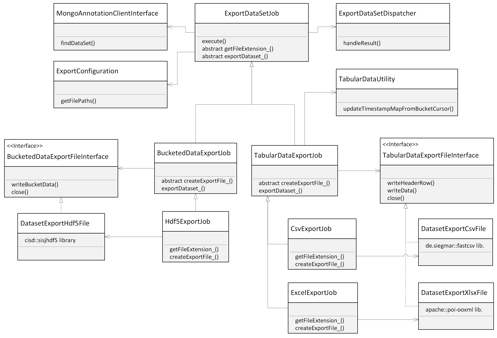

There is a single base class for all export jobs, ExportDataSetJob that controls the execution.  It defines abstract methods that are overridden by derived classes to handle writing data to the particular file format.  It uses the MongoAnnotationClientInterface to find the specified dataset.  It uses ExportDataSetDispatcher to send a response in the API method's response stream.

The new class ExportConfiguration is responsible for reading the export-related config resources and generating file paths and URLs based on that configuration, and is used by the job to generate paths for the export file.

There are two intermediate classes, BucketedDataExportJob and TabularDataExportJob, that provide common logic for writing time-series data organized in "buckets" and writing tabular file formats, respectively.

There is a single concrete class for writing bucketed data, Hdf5ExportJob, that handles writing bucketed data to HDF5 format.

TabularDataExportJob uses utility methods in TabularDataUtility to build a data structure for iterating and accessing data in a tabular fashion.  This functionality is contained in a standalone class so that it can be shared with other code working with tabular data (such as building the result for a tabular data query).

There are two concrete classes for writing tabular data, CsvExportJob and ExcelExportJob, that handle writing tabular data to CSV and XLSX formats, respectively.

The details of writing to specific file formats from the bucketed and tabular data export job classes are defined by two interfaces, BucketedDataExportFileInterface and TabularDataExportFileInterface, respectively.  Hdf5ExportJob uses the concrete interface implementation, DatasetExportHdf5File to write data to HDF5 format.  CsvExportJob uses DatasetExportCsvFile to write to CSV files.  ExcelExportJob uses DatasetExportXlsxFile to write to XLSX files.

The file interface implementation classes use new third party library dependencies (defined in "pom.xml" for lower-level file access APIs.  The libraries "sis-base" and "sis-jhdf5" from "cisd" are used by DatasetExportHdf5File for writing HDF5 files.  The library "fastcsv" from "de.siegmar" is used by DatasetExportCsvFile for writing CSV files.  The library "poi-ooxml" from "org.apache.poi" is used by DatasetExportXlsxFile for writing XLSX files.


### configuration

The Data Platform service implementations all share a simple configuration framework.  The primary objective for the configuration framework is to minimize the code required to retrieve configuration values, such as checking if the resource is defined, checking for a null return value, providing a default value, and casting to common Java types.  We wanted to define methods on the configuration tool that hide those details from the caller as much as possible.

The primary configuration mechanism is a "yaml" file named "application.yml".  An override file name can be specified either on the command line (using "dp.config") or as an environment variable (using "DP.CONFIG").  Individual config resources can be overridden on the command line by prefixing them with "dp.".

The keys in the configuration file are hierarchical using "." notation.  Given the config file content below:

_# annotationHandler: Settings for the annotation Service request handler._

_annotationHandler:_

_  # annotationHandler.numWorkers: Number of worker threads used by the annotation Service request handler._

_  # This parameter might take some tuning on deployments to get the best performance._

_  numWorkers: 7_

the number of workers for the annotation service is obtained using the key "AnnotationHandler.numWorkers".

The diagram below shows the Data Platform "ConfgurationManager", with some example uses including "MongoAnnotationHandler", "AnnotationGrpcServer", and "BenchmarkStreamingIngestion", which retrieve number of workers, port number, and connect string, respectively.


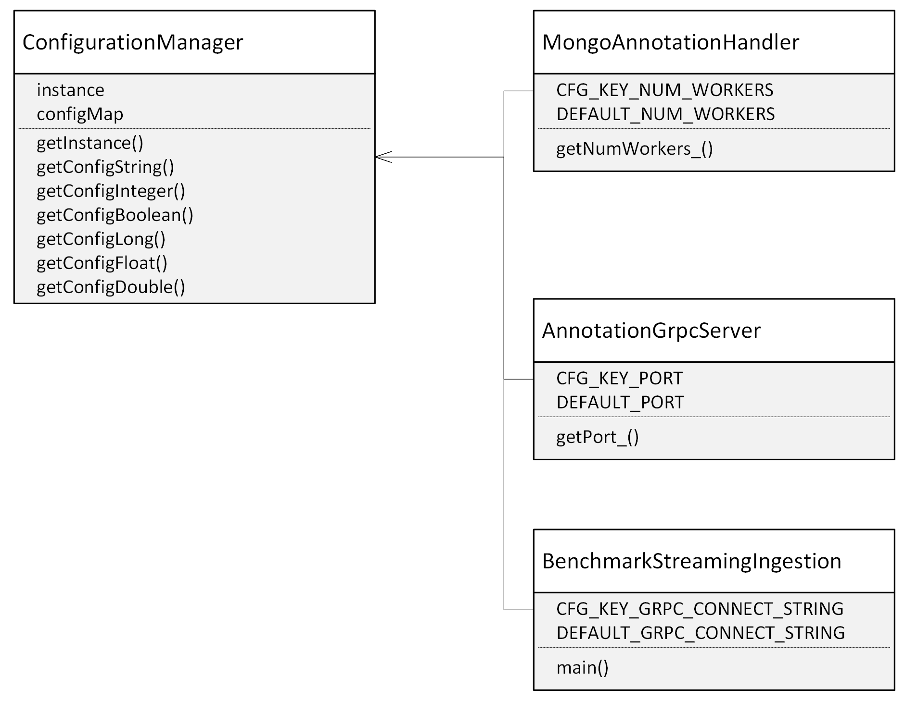


The "ConfigurationManager" provides methods for accessing config resources casted to common Java types such as "getConfigString()" and "getConfigInteger()".  Each accessor method has two variants, one that returns the casted resource value of null if not defined, and the other that uses a default value parameter to return the default value if the resource is not defined.  This allows the caller to not check for null, not cast the value, and not override with a default, etc.

The "ConfigurationManager" is a "singleton" pattern implementation, so the first call to its "getInstance()" method initializes the config manager by reading the default or specified override config file and applying any overrides of individual resource values.  Most usage within Data Platform applications looks like the snippet below:

_configMgr().getConfigInteger(CFG_KEY_NUM_WORKERS, DEFAULT_NUM_WORKERS)_

where "configMgr()" is a convenience method for accessing the singleton "ConfigurationManager" instance.

### performance benchmarking

Because performance is the most important requirement for the Data Platform Ingestion Service, we developed a benchmarking framework in parallel with the service implementation so that we could measure performance at each stage of development and compare different approaches (such as comparing the performance obtained with the MongoDB Java "sync" driver with the "reactivestreams" one).  The same pattern was followed to build a performance benchmark framework for the Query Service implementation.

Both benchmark frameworks use the MongoDB database "dp-benchmark".  Before each run of any benchmark, the contents of that database are removed and new contents are added by the benchmark.

Benchmark-specific servers, "BenchmarkIngestionGrpcServer" and "BenchmarkQueryGrpcServer", were added that override the standard Ingestion and Query service network ports for those services to avoid adding benchmark data to a live production database.

#### ingestion service performance benchmarking

The diagram below shows the elements of the ingestion performance benchmarking framework.


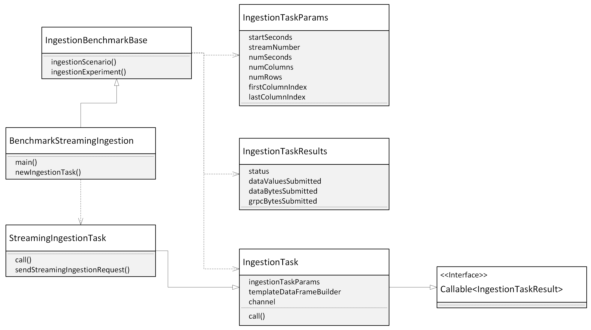


The framework supports running ingestion scenarios for different approaches, so the base class "IngestionBenchmarkBase" contains the key framework components for running an ingestion benchmark.  It defines the nested class "IngestionTask" to encapsulate the logic for invoking an ingestion API, creating the stream of ingestion requests, and handling the API response stream.  The nested classes "IngestionTaskParams" and "IngestionTaskResults" are used to contain the parameters needed by the task and to return performance results from the task.

"IngestionBenchmarkBase" provides the method "ingestionExperiment()" for sweeping combinations of parameter values for variables like number of threads and number of API streams, and calculating an overall performance benchmark for the run.  The lower level method "ingestionScenario()" is used by the experiment driver method to run an individual scenario and measure its performance.  This method is also used in the integration test framework to create a regression test that not only runs the ingestion scenario to create data in the archive, but verifies database contents and API responses.  See [section "integration testing"](#integration-testing) for more details.

The application class "BenchmarkStreamingIngestion" extends the base class to run a performance benchmark for the "ingestDataStream()" bidirectional streaming Ingestion Service API.  It defines the nested class "StreamingIngestionTask", implementing the "call()" method to call the API, send a stream of requests, handle the response stream, and collect performance stats.


#### query service performance benchmarking

The query service benchmark framework is a bit more complicated than the ingestion service framework because it also loads the data into MongoDB to be used in the performance benchmark.  Initially, it utilized data loaded by the ingestion benchmark, but we decided to make it a standalone application and added the data-loading mechanism.  The diagram below shows the query service benchmark framework.


The core class of the framework is "QueryBenchmarkBase".  For loading data, it uses a multithreaded "ExecutorService" with the custom "Callable" task class "InsertTask".  Each task loads data as specified by the "InsertTaskParams" passed to the task, and returns a "InsertTaskResult" with details including the number of data buckets inserted by the task.  Loading data is triggered by the method "loadBucketData()".

The query performance benchmark part of the framework follows a similar pattern as described for the ingestion benchmark, above.  The base class provides a higher-level method "queryExperiment()" to sweep parameter value combinations for total number of PVs, number of PVs per request, and number of threads.  The experiment driver uses the lower-level method "queryScenario()" to measure performance for a particular combination of parameter values.

An "ExecutorService" is used with custom tasks that extend the classes "QueryTask", "QueryDataRequestTask", or "QueryDataResponseTask" to call a specific query API, handle the response stream, and calculate statistics.

Various concrete performance benchmark application classes extend the base class, each measuring the performance of a particular query API.  The query benchmark application classes include "BenchmarkQueryDataStream", "BenchmarkQueryDataBidiStream", and "BenchmarkQueryDataUnary".  Each of them defines a concrete custom task class that extends one of the framework task base classes.

For example, the benchmark application class "BenchmarkQueryDataStream" shown in the diagram above defines the task class "QueryResponseStreamTask" that extends "QueryDataResponseTask".  Each task calls the "queryDataStream()" API and keeps track of the number of values and bytes sent for use in performance statistics.

### generating sample data

Recognizing the previous use of the ingestion performance benchmark application for creating test data for web app development and demo, a new TestDataGenerator utility has been added.  A more fully featured simulator / generator is under development, but in the meantime this tool can be used to generate sample data for use in web application development or demo purposes.  Like the ingestion benchmark, it generates one minute's data for 4000 PVs sampled at 1 KHz.

To use the sample data generator, the standard ingestion service should be running ("IngestionGrpcServer").  This captures data to the standard "dp" database instead of the benchmark-specific "dp-benchmark" database.

The dp-support repo contains a wrapper script in the bin directory for running the sample data generator, "app-run-test-data-generator".

### regression testing

The primary objective for the regression test suite was to allow coverage to be added for essentially any part of the Data Platform common code and service implementations including lower level components, and for the most part that has been accomplished.  Test coverage for the Ingestion and Query service implementations is pretty extensive, and covers some of the lower-level features that are hard to cover in higher-level scenarios.

All regression tests using a MongoDB database named "dp-test".  The Data Platform's MongoDB schema is described in [Section "dp-service MongoDB schema and data flow"](#dp-service-mongodb-schema-and-data-flow).

After adding coverage for both the Ingestion and Query service implementations, we added an "integration testing" framework that provides a mechanism for running higher-level scenarios that involve any/all of the service implementations.  That framework is discussed in [section "integration testing"](#integration-testing).

Since the integration testing framework was added, we've preferred adding test coverage at that level when possible because it exercises the communication framework in addition to the service implementations.  For that reason, there is less low-level test coverage of the annotation service implementation than the other service, but pretty good coverage at the higher-level integration test level.  We will add more extensive low-level coverage for all the services as time goes on to cover more special / unusual cases.

We've used a naming convention for classes that contain jUnit test cases to end the class name with "Test".  The names of base classes that are intended to be extended by concrete test classes end with "Base".

### integration testing

One requirement for this project is to provide integration testing that provides coverage for scenarios that involve multiple services.  We developed an integration testing framework that supports creating tests that include data ingestion, query, and annotation.  The framework is shown in the diagram below.


The core of the framework is the class "GrpcIntegrationTestBase".  The base class is extended by test classes such as "StaggeredTimestampTest", "MetadataQueryTest", "TableQueryTest", and "AnnotationTest".  There are several integration tests focused on different aspects of the Ingestion Service that are not shown in the diagram, but they follow the same pattern (inheriting from "GrpcIntegrationTestBase" and using utility methods in the base class and "IngestionTestBase").  These are discussed in the table summary of the integration tests below.  A special case is "BenchmarkIntegrationTest", which is detailed in the next subsection.

The framework is built using the ["in-process" gRPC framework](https://github.com/grpc/grpc-java/blob/master/examples/src/test/java/io/grpc/examples/helloworld/HelloWorldServerTest.java), which allows multiple gRPC clients and servers to run in a single Java process.  It is a convenient way to build integration test coverage without dealing with synchronizing multiple processes.

The base class's "setUp()" method brings up the Data Platform environment, including Ingestion, Query, and Annotation services using the corresponding service implementation's "init()" method (e.g., "IngestionServiceImpl.init()").  It creates a gRPC channel for each service for invoking RPC methods on that service.  The base class "tearDown()" method shuts down the services using each implementation's "fini()" method.

The base class provides convenience methods for calling service API's, validating the corresponding database artifacts, and verifying the API response stream.  For example, the "AnnotationTest" uses the following base methods to 1) create data in the archive,  2) create data blocks, data sets, and annotations, 3)  query annotations, and 4) query time-series data using the data blocks returned by the annotations query:

1. ingestDataStreamFromColumn()
2. sendAndVerifyCreateDataSet()
3. sendAndVerifyCreateCommentAnnotation()
4. sendAndVerifyQueryAnnotationsOwnerComment()
5. queryDataStream()

Each service implementation provides a test base class with data structures, classes, and utilities for using the service APIs.  For example, "IngestionTestBase" includes the data structure "IngestionRequestParams" to contain the parameters for an ingestion request.  The method "buildIngestionRequest()" creates a gRPC ingestion request object from the params object.  The nested class "IngestionResponseObserver" is a response stream observer for the streaming ingestion API that builds a list of replies for use in verifying the API response.  The classes "QueryTestBase" and "AnnotationTestBase" offer similar utilities for the Query and Annotation Services, respectively.

For API calls that write data to the database, the base class wrapper methods validate the corresponding database artifacts for each API request.  The class "MongoTestClient" provides utilities for retrieving items from the database for validation.  For example, the base class method "ingestDataStreamFromColumn()" calls the bidirectional streaming ingestion API to create data, and then uses "MongoTestClient.findBucket()" and "findRequestStatus()" to retrieve the corresponding database artifacts, comparing their contents to the results expected for the request.  Similarly, the base class methods "sendAndVerifyCreateDataSet()" and "sendAndVerifyCreate…Annotation…()" using test client methods "findDataSet()" and "findAnnotation()", respectively.

The various integration test classes are summarized in the tables below.

#### com.ospreydcs.dp.service.integration.annotation

<table>
  <tr>
   <td><strong>class</strong>
   </td>
   <td><strong>description</strong>
   </td>
  </tr>
  <tr>
   <td>AnnotationTest
   </td>
   <td> This test provides coverage for various aspects of the AnnotationService API including creating and querying DataSets, and creating and querying Annotations. The test runs a simple ingestion scenario to create data for various devices.  It includes both negative and positive tests for createDataSet() using the ingested data.  It includes both negative and postive tests for the queryDataSets() API over the DataSets created by the test.  It includes both negative and positive tests for createAnnotation() using the DataSets created by the test.  It includes negative and positive coverage for queryAnnotations() using the annotations created by the test.  It includes a scenario to run a time-series data query using the DataSet returned by queryAnnotations().  It includes positive and negative test cases for exporing datasets to HDF5, CSV, and XLSX formats.
   </td>
  </tr>
</table>

#### com.ospreydcs.dp.service.integration.ingest

<table>
  <tr>
   <td><strong>class</strong>
   </td>
   <td><strong>description</strong>
   </td>
  </tr>
  <tr>
   <td>DataTypesTestBase
   </td>
   <td> This base class includes test scenarios for ingestion of "complex" data types, including 2D array, image, and structure data and verification of ingestion results.  It defines the abstract method sendAndVerifyIngestionRpc_() that is overridden by subclasses to call one of the ingestion APIs.
   </td>
  </tr>
  <tr>
   <td>DataTypesUnaryTest
   </td>
   <td> Extends DataTypesTestBase and overrides sendAndVerifyIngestionRpc_() to test ingestion of complex data types using the unary ingestion API, ingestData().
   </td>
  </tr>
  <tr>
   <td>DataTypesStreamingTest
   </td>
   <td> Extends DataTypesTestBase and overrides sendAndVerifyIngestionRpc_() to test ingestion of complex data types using the bidirectional streaming ingestion API, ingestDataStream().
   </td>
  </tr>
  <tr>
   <td>ExplicitTimestampListTest
   </td>
   <td> Provides coverage for ingestion of data using DataTimestamps with an explicit TimestampsList (instead of SamplingClock, covered in most of the other ingestion integration tests).
   </td>
  </tr>
  <tr>
   <td>ReisterProviderTest
   </td>
   <td> Provides coverage for the registerProvider() API method. 
   </td>
  </tr>
  <tr>
   <td>RequestStatusTest
   </td>
   <td> Provides coverage for the queryRequestStatus() API method.
   </td>
  </tr>
  <tr>
   <td>SubscribeDataTest
   </td>
   <td> Provides coverage for the subscribeData() API method.
   </td>
  </tr>
  <tr>
   <td>UnaryTest
   </td>
   <td> Provides coverage for ingestion of data using the unary ingestion API, ingestData().  Includes simple negative and positive test scenarios.
   </td>
  </tr>
  <tr>
   <td>UnidirectionalStreamTest
   </td>
   <td> Provides coverage for the ingestDataStream() API method.
   </td>
  </tr>
  <tr>
   <td>ValidationTest
   </td>
   <td> Currently sort of a placeholder, but provides coverage for a single rejection scenario.  There is more extensive rejection test coverage in the regular unit test IngestionValidationUtilityTest, but I wanted a rejection test that exercises the gRPC communication framework to make sure it works as expected at the API level.
   </td>
  </tr>
</table>

#### com.ospreydcs.dp.service.integration.query

<table>
  <tr>
   <td><strong>class</strong>
   </td>
   <td><strong>description</strong>
   </td>
  </tr>
  <tr>
   <td>MetadataQueryTest
   </td>
   <td> This test provides coverage for the Query Service's queryMetadata() API.  It runs a simple ingestion scenario, and then various negative and positive test cases for queryMetadata().
   </td>
  </tr>
  <tr>
   <td>StaggeredTimestampTest
   </td>
   <td> This test provides coverage for queries in a more interesting scenario for ingested data.  I added it when we added the queryDataTable() API to make sure that the query table result was correct when ingested PV data used different sample periods, and when the query time range was intentionally offset from the data bucket begin times.
   </td>
  </tr>
  <tr>
   <td>TableQueryTest
   </td>
   <td> This test provides coverage for the queryDataTable() API using a simpler ingestion scenario than StaggeredTimestampTest.  It includes positive test cases for both column and row-oriented query table result.
   </td>
  </tr>
</table>


#### benchmark integration test

The integration test class "BenchmarkIntegrationTest" is a special case, combining the integration testing and performance benchmarking frameworks in a single test case.  This test runs an ingestion scenario for a larger universe of data, including one minute's data for 4,000 PVs each sample 1,000 times per second.  It then exercises various time-series data queries against that data.  The test validates the database artifacts created by the ingestion scenario, and verifies all API responses including both ingestion and query.

By exercising the streaming data ingestion API method and the three time-series data query API methods, this test covers a large part of the codebase for the Data Platform Ingestion and Query Services.

The benchmark integration test framework is shown in the diagram below.


Like the other integration tests, the benchmark integration test extends "GrpcIntegrationTestBase" and uses "setUp()" and "tearDown()" to bring up the Data Platform services in a single Java process using the in-process gRPC framework.

Unlike the other tests, however, it does not use the base class's wrapper methods for invoking API methods and verifying their results.  Instead, it uses the benchmark framework for that purpose.

The "BenchmarkIntegrationTest" defines the class "IntegrationTestStreamingIngestionApp" which extends the benchmark framework class "BenchmarkStreamingIngestion".  The ingestion app class defines an extension to "StreamingIngestionTask" called "IntegrationTestIngestionTask".  The latter overrides the validation hook methods "onRequest()", "onResponse()", and "onCompleted()" to build a data structure for validating ingestion requests, and validate the requests on their completion (including both database artifacts and API responses).

The benchmark integration test class uses the nested class "IntegrationTestIngestionGrpcClient" to run an ingestion scenario using the method "runStreamingIngestionScenario()" via the benchmark framework method "IntegrationTestStreamingIngestionApp.ingestionScenario()".  This runs the ingestion scenario and triggers the validation hook methods as the scenario is executed.

The same pattern is used to run the query scenarios, though there are more classes involved because we are calling three different query API methods, "queryDataStream()", "queryDataBidiStream()", and "queryData()".

The "queryDataStream()" scenario is handled by the benchmark integration test's nested class "IntegrationTestQueryResponseStreamApp" and its concrete task extension "IntegrationTestQueryResponseStreamTask".

The "queryDataBidiStream()" scenario is handled by the nested class "IntegrationTestQueryResponseCursorApp" with task subclass "IntegrationTestQueryResponseCursorTask".

The "queryData()" scenario is handled by nested class "IntegrationTestQueryResponseSingleApp" with task subclass "IntegrationTestQueryResponseSingleTask".

In all three cases, the task subclass dispatches the validation hook methods "onRequest()", "onResponse()", and "onCompleted()" to the "IntegrationTestQueryTaskValidationHelper" managed by the nested class "IntegrationTestQueryGrpcClient".  The helper implements the validation hooks to build data structures with information about the API requests, and uses them to verify the query results returned in the response stream.

The "IntegrationTestQueryGrpcClient" provides methods for running each of the three query API scenarios, "runQueryResponseStreamScenario()", "runQueryResponseCursorScenario()", and "runQueryResponseSingleScenario()".  Each query scenario retrieves one minute's data for 1,000 PVs, and uses the validation hook method implementations to verify the query results.
